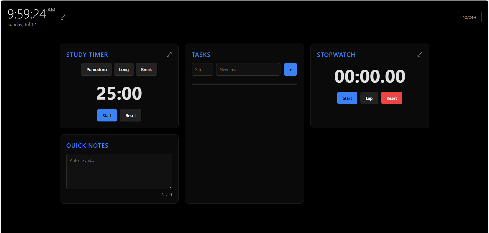

# Student Focus Dashboard

Student Focus Dashboard is a lightweight, browser-based productivity dashboard built for studying and focus sessions. It combines a live clock, Pomodoro-style timer, task manager, stopwatch, quick notes, and a daily progress summary in one clean, dark interface.

## Features

- **Header** — prominent live clock with 12/24-hour toggle, clean full date display, live "Focus Mode" indicator, a settings dialog, and a day/night theme toggle
- **Day & Night theme** — switch between light and dark with the sun/moon button; the choice is remembered and it follows your system preference until you override it
- **Study Timer** — Pomodoro / Long / Break presets with a circular progress ring, mode labels (FOCUS, SHORT BREAK, LONG BREAK), session counting ("Session 2 of 4"), daily focus-time stat, and optional auto-start for the next session
- **Tasks** — add tasks with subject (DSA, DBMS, Python, College, Personal) and priority (Low / Medium / High), check off, edit inline, delete, filter by All / Active / Completed, high-priority active tasks sorted first, and a completion progress bar
- **Stopwatch** — accurate Start / Lap / Reset with a lap history you can clear; the Start button flips to Pause while running
- **Quick Notes** — larger auto-saving textarea with live character count, "Saved just now" status, Ctrl+S save, and a guarded Clear button
- **Daily Progress** — focus time, tasks completed, pomodoros, and an overall productivity percentage calculated live from app data
- **Full-screen focus overlays** for the clock, timer, and stopwatch (click to start/pause, double-click to exit)
- Everything persists in `localStorage` — no backend required

## Keyboard Shortcuts

| Key | Action |
| --- | --- |
| `Space` | Start / Pause the study timer |
| `R` | Reset the timer |
| `N` | Focus the new-task input |
| `Ctrl` + `S` | Save notes immediately |

## How To Use

1. Open `index.html` in a browser.
2. Add tasks, start a focus timer, or use the stopwatch as needed.
3. Use the settings (gear) button to adjust timer durations, sessions per cycle, auto-start, and sounds.
4. Use the full-screen buttons for a distraction-free view.

## Project Files

- `index.html` — Main dashboard layout
- `style.css` — App styling (light & dark theme design system)
- `script.js` — Timer, tasks, notes, statistics, and fullscreen behavior
- `student-focus-dashboard.png` — Screenshot used in this README

## Responsive

Works on desktop (3-column), tablet (2-column), and mobile (stacked, touch-friendly).